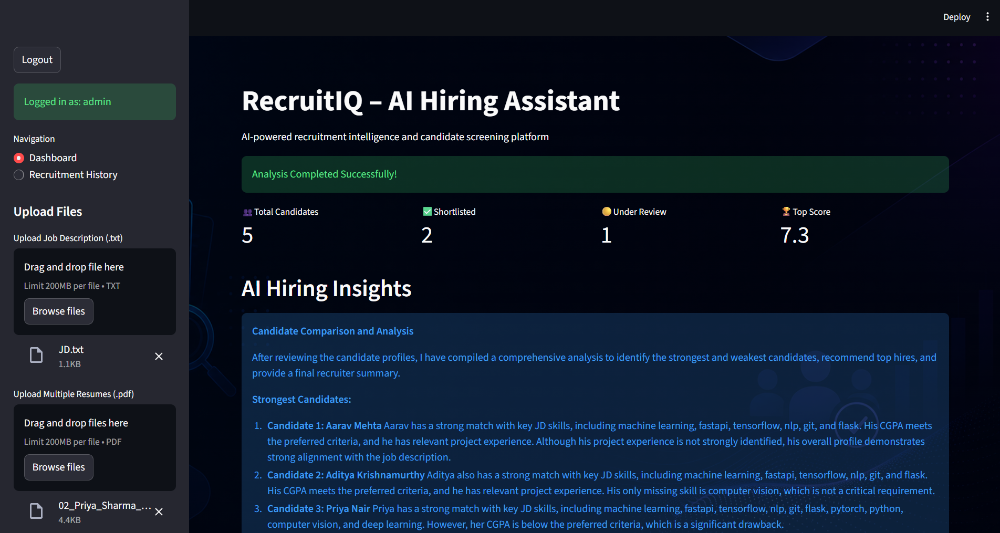
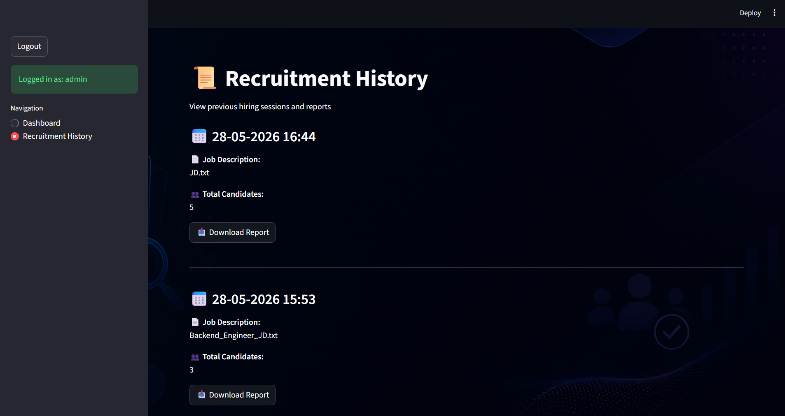
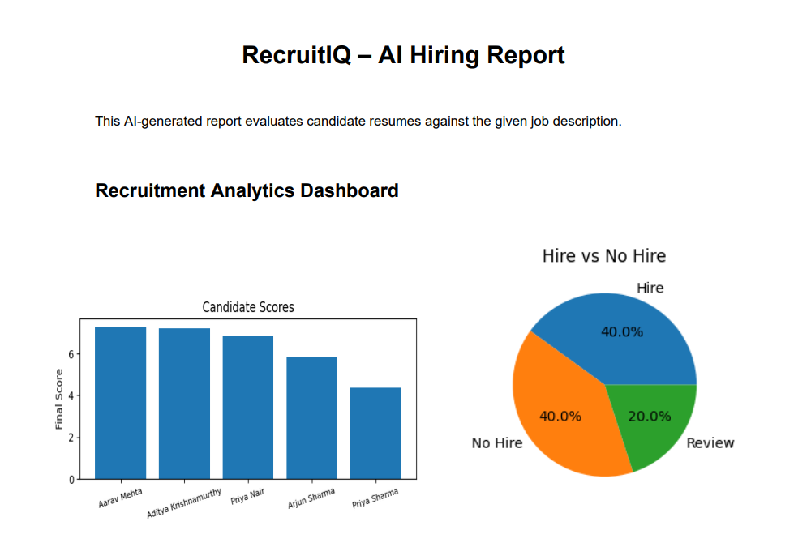
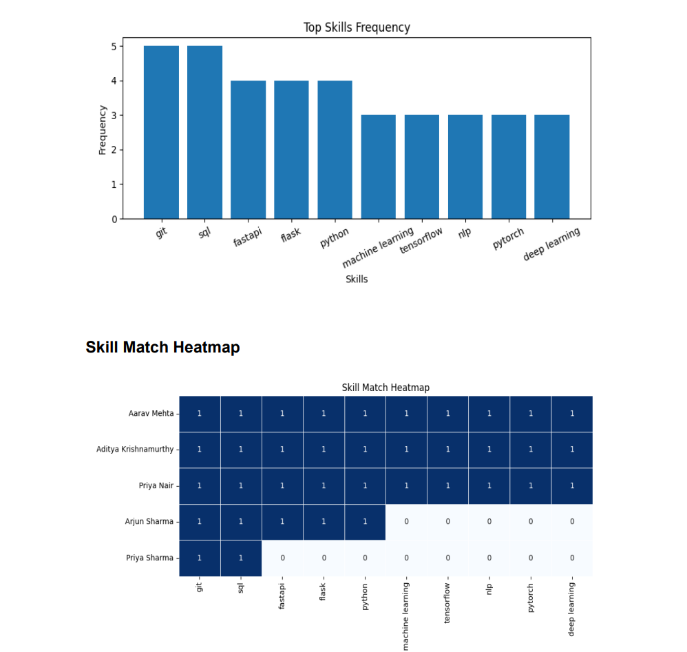

# 📑 RecruitIQ-AI-Hiring-Assistant
AI-powered resume screening and recruitment platform with semantic matching, candidate ranking, PDF reporting, recruitment history, and secure HR login dashboard built using Streamlit and LangChain.


## Features
- Resume Parsing
- Job Description Analysis
- Skill Matching Engine
- Weighted Candidate Scoring
- Semantic Resume Matching
- Candidate Ranking System
- AI-based Hiring Recommendation
- PDF Report Generation
- Recruitment History Tracking
- Secure HR Login System
- Interactive Streamlit Dashboard


## Tech Stack
- **Frontend using Streamlit**
- **Backend with Python**
- **Langchain and Groq LLM as core AI tools**
- **SQLite for Database**
- **Visualization using Matplotlib and Seaborn**
- **Report Generation using Report Lab**


## Project Workflow
1. HR logs into the platform securely
2. HR uploads Job Description file
3. Multiple resumes are uploaded
4. AI tools extracts structured information from resumes
5. Resume skills are matched with JD requirements
6. Candidates are scored using weighted scoring
7. Candidates are ranked automatically
8. Reports and analytics are generated
9. HR can view candidates resume individually and email them
10. Recruitment history is stored for future access

## Screenshots

<table>
  <tr>
    <td>
      
    </td>

<td>
  
</td>


  </tr>

  <tr>
    <td>
      
    </td>

<td>
  
</td>


  </tr>
</table>


## Scoring Criteria
| Parameter           | Weightage |
| ------------------- | --------- |
| Skills Matching     | 30%       |
| CGPA Matching       | 25%       |
| Project Relevance   | 20%       |
| Education Matching  | 15%       |
| Communication Score | 10%       |


## Recommendation Logic
- Hire → Strong skill and score match
- Review → Almost complete skill match with minor missing criteria
- No Hire → Low overall relevance


## Installation
#### Clone Repository
```
git clone https://github.com/agrawalanshika/RecruitIQ-AI-Hiring-Assistant.git
```

#### Navigate to Project
``` cd RecruitIQ-AI-Hiring-Assistant ```

#### Install Dependencies
``` pip install -r requirements.txt ```

#### Add Environment Variables
Create a .env file:
```
GROQ_API_KEY=your_api_key
```

#### Run Application
``` streamlit run streamapp.py ```


## Folder Structure
```text
RecruitIQ-AI-Hiring-Assistant/
│
├── app/
├── data/
├── streamapp.py
├── main.py
├── requirements.txt
├── README.md
```


## Future Improvements
1. LinkedIn Profile Analysis
2. Interview Scheduling
3. Multi-HR Authentication
4. Cloud Deployment


## Author
### 👤 Anshika Agrawal


